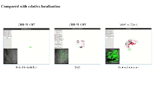

# JointLoc

[IROS 2024] JointLoc: A Real-time Visual Localization Framework for Planetary UAVs Based on Joint Relative and Absolute Pose Estimation


## Update

### 2024.06.30

The paper has been accepted by IROS 2024. The the test dataset is uploaded. You can download the test dataset from [Google Drive](https://drive.google.com/drive/folders/1yAkHwNPdhbssDJqgm2Jvgculvo8pLQz6?usp=sharing) and extract it to the `JointLoc` directory.

We are preparing the main files (`vslam` in RelLoc and `vloc` in AbsLoc) and will upload them soon.

### 2024.04.26

Most codes of the AbsLoc and RelLoc modules are uploaded. Meanwhile, the main files are deleted due to the privacy of the project. We will provide the main files and the test datset after the paper is accepted.

## Getting Started

### Installation

```bash
git clone https://github.com/LuoXubo/JointLoc.git
cd JointLoc
```

Setup the environment:

```bash
conda create -n JointLoc python=3.7 --yes
conda activate JointLoc
cd AbsLoc
pip install -r requirements.txt
```

Besides the python packages, you also need to configure the OpenCV, Eigen, and Ceres Solver. You can refer to the [ORB-SLAM3](https://github.com/UZ-SLAMLab/ORB_SLAM3) to install them.

To connect the absolute localization and relative localization modules, you need to configure the Redis and Protobuf modules.

```bash
wget https://github.com/redis/hiredis/archive/refs/tags/v1.1.0.zip
unzip hiredis-1.1.0.zip
cd hiredis-1.1.0
mkdir build && cd build
cmake ..
make -j8
sudo make install

wget https://github.com/sewenew/redis-plus-plus/archive/refs/tags/1.3.8.zip
unzip redis-plus-plus-1.3.8.zip
cd redis-plus-plus-1.3.8
mkdir build && cd build
cmake ..
make -j8
sudo make install

wget https://github.com/protocolbuffers/protobuf/archive/refs/tags/v3.25.2.zip
unzip protobuf-3.25.2.zip
cd protobuf-3.25.2
mkdir build && cd build
cmake -Dprotobuf_BUILD_TESTS=OFF -Dprotobuf_BUILD_EXAMPLES=OFF ..
make -j8
sudo make install
```

## Quick Demo

### Download the dataset

Download the test dataset from [Google Drive](https://drive.google.com/drive/folders/1yAkHwNPdhbssDJqgm2Jvgculvo8pLQz6?usp=sharing) and extract it to the `JointLoc` directory. The given dataset and your own dataset should have the following structure:

```
JointLoc
├── dataset
│   ├── [Terrain]_dataset
│   │   ├── uav
│   │   │   ├── images
│   │   │   │   ├── 000000.png
│   │   │   │   ├── 000001.png
│   │   │   │   ├── ...
│   │   │   ├── images.txt
│   │   │   ├── gt.txt
│   │   │   ├── ...
│   │   ├── satelite
│   │   │   ├── 0_x0_y0.png
│   │   │   ├── 0_x0_y1.png
│   │   │   ├── ...
│   │   ├── satelite.png
│   ├── ...
```

### Run the demo

```bash
sh demo.sh
```

This script will open 3 temrminals:

1. The first terminal will open redis-server.
2. The second terminal runs the relative localization (SLAM) system in /RelLoc/ directory.
3. The third terminal runs the absolute localization system in /AbsLoc/ directory.

## Evaluation

The estimated 6-DoF poses of JointLoc will be saved in `results/poses.txt`. You can evaluate the performance by running the following script:

```bash
evo_ape tum dataset/groundtruth.txt results/poses.txt -pv
```

## Compared with ORB-SLAM2 and ORB-SLAM3

We also provide the code to run ORB-SLAM2 and ORB-SLAM3 on the same dataset. You can run the following script:

```bash
sh run_orb_slam2.sh
sh run_orb_slam3.sh
```

### Visualization



## Acknowledgement

This work incorporates many open-source codes. We extend our gratitude to the authors of the software.

- [ORB-SLAM2](https://github.com/raulmur/ORB_SLAM2)
- [ORB-SLAM3](https://github.com/UZ-SLAMLab/ORB_SLAM3)
- [SuperPoint](https://github.com/rpautrat/SuperPoint)
- [LightGlue](https://github.com/cvg/LightGlue)

## Citation

If you find this repo useful for your research, please consider citing the paper

```
@misc{luo2024jointloc,
      title={JointLoc: A Real-time Visual Localization Framework for Planetary UAVs Based on Joint Relative and Absolute Pose Estimation},
      author={Xubo Luo and Xue Wan and Yixing Gao and Yaolin Tian and Wei Zhang and Leizheng Shu},
      year={2024},
      eprint={2405.07429},
      archivePrefix={arXiv},
      primaryClass={cs.RO}
}
```

## Star History

[](https://star-history.com/#LuoXubo/JointLoc&Date)
